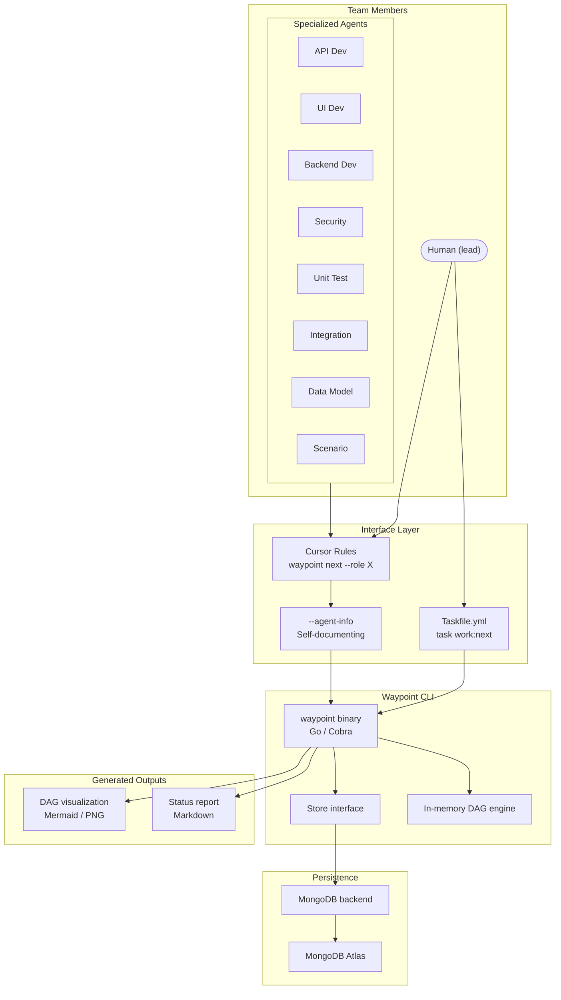
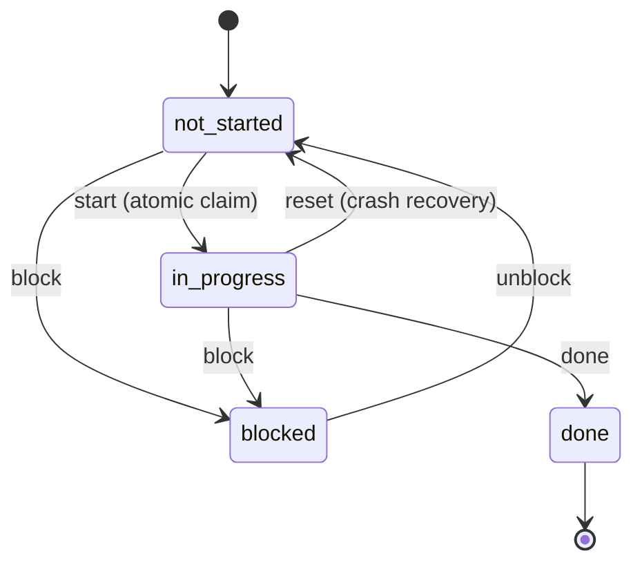

# Architecture

This document describes the high-level architecture of Waypoint.

## System Overview



## Components

### CLI Layer (`internal/cli/`)

Cobra-based command definitions. Each command is a separate file. The root command handles global flags (`--agent-info`), configuration loading (environment variables / `.env` file), and MongoDB connection setup.

Commands are grouped by purpose:
- **Lifecycle:** `init`, `sync`, `validate`
- **Mutations:** `add`, `remove`
- **Workflow:** `next`, `start`, `done`, `block`, `unblock`, `reset`
- **Reporting:** `status`, `report`, `viz`, `critical-path`

### DAG Engine (`internal/dag/`)

In-memory graph algorithms operating on work items loaded from the store. All graph logic runs in Go, not in database queries. This keeps the Store interface simple (CRUD only) and makes the graph logic backend-agnostic.

Key operations:
- **Build** -- construct adjacency list from `dependencies` arrays
- **Validate** -- cycle detection (topological sort), dangling dependency check, status consistency, role validation, phase integrity
- **Readiness** -- find items where all dependencies are `done` and status is `not_started`
- **Critical path** -- longest-path computation through the DAG

### Store Interface (`internal/store/`)

```go
type Store interface {
    ListWorkItems(ctx context.Context, project string) ([]WorkItem, error)
    GetWorkItem(ctx context.Context, project string, id string) (*WorkItem, error)
    ClaimWorkItem(ctx context.Context, project string, id string, claimedBy string) (*WorkItem, error)
    ReleaseWorkItem(ctx context.Context, project string, id string) error
    UpdateStatus(ctx context.Context, project string, id string, status Status, note string) error
    SeedProject(ctx context.Context, project string, items []WorkItem, phases []Phase) error
    ListPhases(ctx context.Context, project string) ([]Phase, error)
}
```

Ships with a MongoDB implementation. The interface enables future backends (SQLite, PostgreSQL, Neo4j) without changing application logic.

`ClaimWorkItem` uses MongoDB's `findOneAndUpdate` with a `status: "not_started"` precondition, providing an atomic compare-and-swap that prevents concurrent double-pickup.

### Visualization (`internal/viz/`)

Generates DAG visualizations in two formats:
- **Mermaid markdown** -- for GitHub, GitLab, and platforms with native mermaid rendering
- **PNG** -- for Confluence, wikis, Slack, and other platforms

PNG rendering uses a `Renderer` interface with two backends:
- **Local (default):** `chromedp` drives headless Chrome/Chromium
- **Cloud:** HTTP call to mermaid.ink (or configurable self-hosted renderer)

## Data Model

### MongoDB Collections

Database: `waypoint` (configurable via `WAYPOINT_MONGO_DATABASE`)

**`work_items` collection:**

```json
{
  "_id": "WI-009",
  "title": "GitHub Provider Adapter",
  "phase": 2,
  "owner": "agent",
  "role": "backend_dev",
  "status": "not_started",
  "dependencies": ["WI-003", "WI-006"],
  "claimed_by": null,
  "started_at": null,
  "completed_at": null,
  "duration_seconds": null,
  "blocker_note": null,
  "project": "breezy",
  "updated_at": "2026-03-01T00:00:00Z"
}
```

**`phases` collection:**

```json
{
  "_id": "breezy:1",
  "number": 1,
  "name": "Foundation",
  "target": "Apr 2026",
  "project": "breezy"
}
```

The `target` field is a freeform string -- informational only. Waypoint does not parse or enforce scheduling; that is owned by whatever external process drives the timeline.

### Indexes

- `work_items`: `{project: 1, status: 1}`, `{project: 1, role: 1}`
- `phases`: `{project: 1}`

### Roles

| Role          | Type  | Description                                               |
|---------------|-------|-----------------------------------------------------------|
| `lead`        | human | Project lead -- decisions, reviews, approvals             |
| `api_dev`     | agent | API endpoints, route handlers, request/response contracts |
| `ui_dev`      | agent | UI screens, mobile UX, frontend components                |
| `backend_dev` | agent | Service layer, business logic, provider adapters          |
| `security`    | agent | Auth flows, token management, vulnerability review        |
| `unit_test`   | agent | Unit test coverage for services and models                |
| `integration` | agent | Integration tests, E2E flows, contract testing            |
| `data_model`  | agent | Database schemas, migrations, indexes, seed data          |
| `scenario`    | agent | Test scenarios, mock data generation, edge cases          |

## Status Lifecycle



Transitions are enforced by the CLI. The `start` transition validates that all dependencies are `done` before allowing the claim.

## Concurrency Model

### Atomic Claim

```
findOneAndUpdate(
  {_id: "WI-009", status: "not_started"},
  {$set: {status: "in_progress", claimed_by: "backend_dev", started_at: ISODate()}}
)
```

If another agent already claimed the task, MongoDB returns null and the CLI reports the conflict. No race condition possible.

### Crash Recovery

- `waypoint status` flags tasks `in_progress` longer than a configurable threshold (default: 24 hours) as `STALE`
- `waypoint status --output json` provides the full DAG state as structured JSON for programmatic agent inspection
- `waypoint reset <WI-ID>` releases orphaned tasks back to `not_started`
- No heartbeats or leases -- human review is sufficient at this scale

## DAG Validation

Runs automatically before mutating operations and on-demand via `waypoint validate`:

- **Cycle detection** -- topological sort; reject if cycles exist
- **Dangling dependencies** -- every dependency ID must exist in the project
- **Status consistency** -- `in_progress` or `done` items should not have `not_started` dependencies
- **Valid roles** -- all role values must be from the known set
- **Phase integrity** -- all referenced phases exist; no empty phases
- **Duplicate IDs** -- no two items share the same ID

## Key Flows

### Agent Workflow

```
Agent runs `waypoint next --role backend_dev`
  → CLI loads all items from MongoDB
  → DAG engine finds items with all deps done, matching role
  → Returns ready items

Agent runs `waypoint start WI-009`
  → CLI attempts atomic claim via findOneAndUpdate
  → If successful: status = in_progress, started_at = now()
  → If failed: "already claimed" error, agent runs `next` again

Agent completes work, runs `waypoint done WI-009`
  → CLI sets status = done, completed_at = now(), computes duration
  → Downstream items may now appear in `next` results
```

### DAG Evolution

```
User updates seed/workitems.yaml (adds items, changes deps)
  → Commits to git

User runs `waypoint sync seed/workitems.yaml`
  → CLI loads YAML, loads current MongoDB state
  → Validates resulting DAG (cycles, dangling deps)
  → Applies changes: adds new items, updates modified, flags removals
  → Preserves status and timestamps on existing items
```

## Related Documents

- [Overview](overview.md) -- product capabilities
- [Roadmap](roadmap.md) -- planned work
- [Design: DAG Work Tracking](design/001-dag-work-tracking.md) -- core design spec
